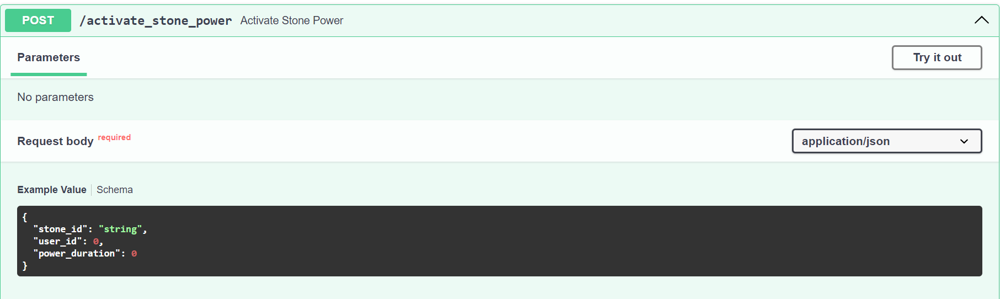

# Below are the steps to setup/start "Infinity Stone" server:
## Pre-Requisite
- Python>=3.9
- RabbitMQ
- Mysql

### Install all the requiements by running:
        pip install -r requirements.txt

### After installation, start backend server by simply running:
        python .\run.py

## You can access swagger API by:

http://localhost:8000/docs

### In the above image the request parameter should be like:
            {
                "stone_id": "stone123",
                "user_id": 1234,
                "power_duration": 60
            }

### To test websocket api simply run:
        python .\test.py

# Thank You :)